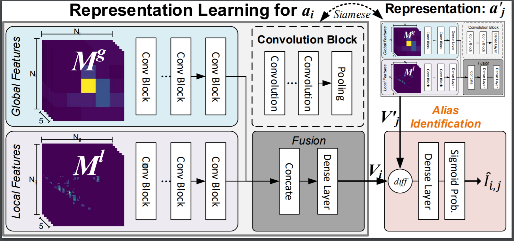
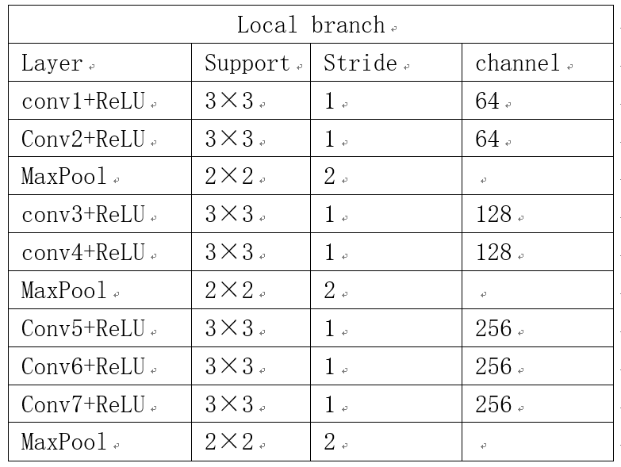
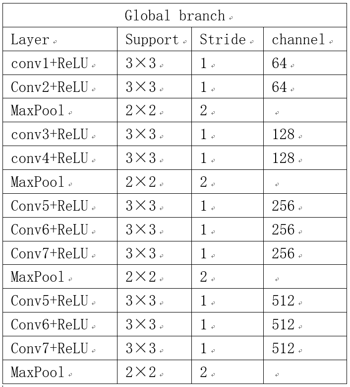

# poi_alias_discovery
POI Entity Linking (POIEL) algorithm for finding alias of POIs. The algorithm is inspired by the fact that people usually stays around their shipping address.

### Model Framework
  

### backbone

