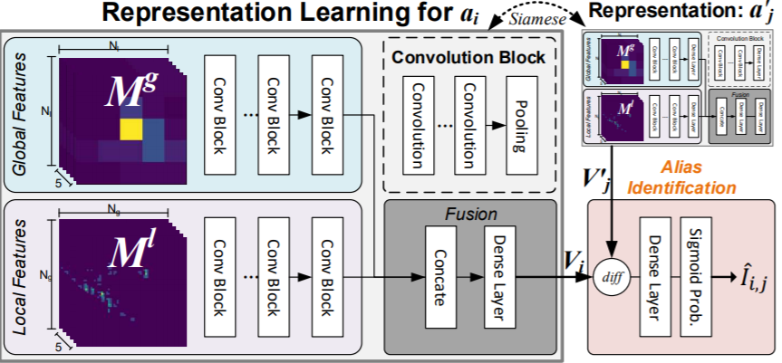

# poi_alias_discovery
POI Entity Linking (POIEL) algorithm for finding alias of POIs. The algorithm is inspired by the fact that people usually stays around their shipping address.

### Model Framework
  

### backbone
| global branch |         |        |         | local branch |         |        |         |
|:-------------:|---------|--------|---------|:-------------:|---------|--------|---------|
| layer         | support | stride | channel | layer         | support | stride | channel |
| conv1+relu    | 3×3     | 1      | 64      | conv1+relu    | 3×3     | 1      | 64      |
| conv2+relu    | 3×3     | 1      | 64      | conv2+relu    | 3×3     | 1      | 64      |
| max_pool      | 2×2     | 2      |         | max_pool      | 2×2     | 2      |         |
| conv3+relu    | 3×3     | 1      | 128     | conv3+relu    | 3×3     | 1      | 128     |
| conv4+relu    | 3×3     | 1      | 128     | conv4+relu    | 3×3     | 1      | 128     |
| max_pool      | 2×2     | 2      |         | max_pool      | 2×2     | 2      |         |
| conv5+relu    | 3×3     | 1      | 256     | conv5+relu    | 3×3     | 1      | 256     |
| conv6+relu    | 3×3     | 1      | 256     | conv6+relu    | 3×3     | 1      | 256     |
| conv7+relu    | 3×3     | 1      | 256     | conv7+relu    | 3×3     | 1      | 256     |
| max_pool      | 2×2     | 2      |         | max_pool      | 2×2     | 2      |         |
| conv8+relu    | 3×3     | 1      | 512     |               |         |        |         |
| conv9+relu    | 3×3     | 1      | 512     |               |         |        |         |
| conv10+relu   | 3×3     | 1      | 512     |               |         |        |         |
| max_pool      | 2×2     | 2      |         |               |         |        |         |